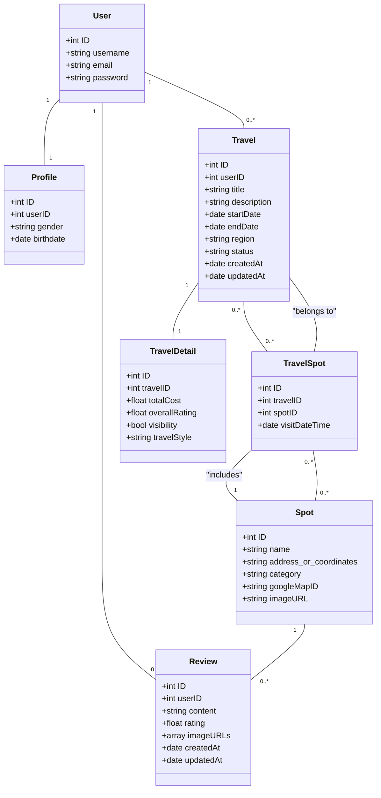

# ドメインモデリング

## 主要エンティティ

1. **ユーザー（User）**
2. **プロファイル（Profile）**
3. **旅行（Travel）**
4. **スポット（Spot）**
5. **レビュー（Review）**
6. **旅行スポット（TravelSpot）**
7. **旅行詳細（TravelDetail）**

### エンティティの定義と関係

### 1. **ユーザー（User）**

- ID
- ユーザー名
- メールアドレス
- パスワード

**関係**：

- プロファイルと1対1の関係。
- 旅行、レビューと1対多の関係。

### 2. **プロファイル（Profile）**

- ID
- ユーザーID
- 性別
- 生年月日

**関係**：

- ユーザーと1対1の関係。

---

### 3. **旅行（Travel）**

- ID
- ユーザーID
- タイトル
- 説明
- 開始日
- 終了日
- 地域
- 状態（計画中、実行中、完了）
- createdAt
- updatedAt

**関係**：

- ユーザーと1対多の関係。
- 旅行スポットと多対多の関係。
- 旅行詳細と1対1の関係。

---

### 4. **スポット（Spot）**

- ID
- 名称
- 住所（または座標）
- カテゴリ（主情報/サブ情報）
- GoogleMap ID（存在する場合）
- 画像URL

**関係**：

- 旅行スポットと多対多の関係。
- レビューと1対多の関係。

---

### 5. **レビュー（Review）**

- ID
- ユーザーID
- 内容
- 評価（スポット/旅行）
- 画像URLリスト
- createdAt
- updatedAt

**関係**：

- ユーザーと1対多の関係。
- スポットと1対多の関係。

---

### 6. **旅行スポット（TravelSpot）**

- ID
- 旅行ID
- スポットID
- 訪問日時（DateTime）

**関係**：

- 旅行と多対1の関係。
- スポットと多対1の関係。

---

### 7. **旅行詳細（TravelDetail）**

- ID
- 旅行ID
- 合計費用
- 旅行全体評価
- 公開/非公開設定
- 旅行スタイル

**関係**：

- 旅行と1対1の関係。

---

### UMLクラス図 (Mermaid)

### 説明

- **ユーザー（User）**：システム内でユーザーを特定するための基本情報。
- **プロファイル（Profile）**：ユーザーの恒久的な情報（性別、生年月日）を保持し、ユーザーIDを外部キーとして持つ。
- **旅行（Travel）**：旅行計画および実行中の旅行全体の記録。旅行の状態（status）は「Planning」（計画中）、「In Progress」（実行中）、「Completed」（完了）を示す。ユーザーIDを外部キーとして持つ。
- **スポット（Spot）**：訪れた場所やイベントの詳細情報。主情報とサブ情報として区別し、GoogleMapとの連携をサポート。
- **レビュー（Review）**：各スポットに基づく評価。複数の画像を添付することができ、作成日および更新日を含む。ユーザーIDを外部キーとして持つ。
- **旅行スポット（TravelSpot）**：旅行内のスポット訪問を日時情報とともに保持する中間エンティティ。旅行IDおよびスポットIDを外部キーとして持つ。
- **旅行詳細（TravelDetail）**：旅行完了後の合計費用、全体評価、および公開/非公開設定を保持するエンティティ。旅行IDを外部キーとして持ち、旅行スタイルも保持する。